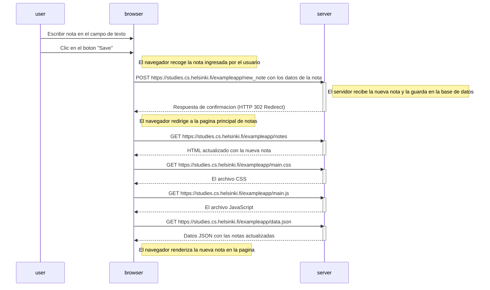
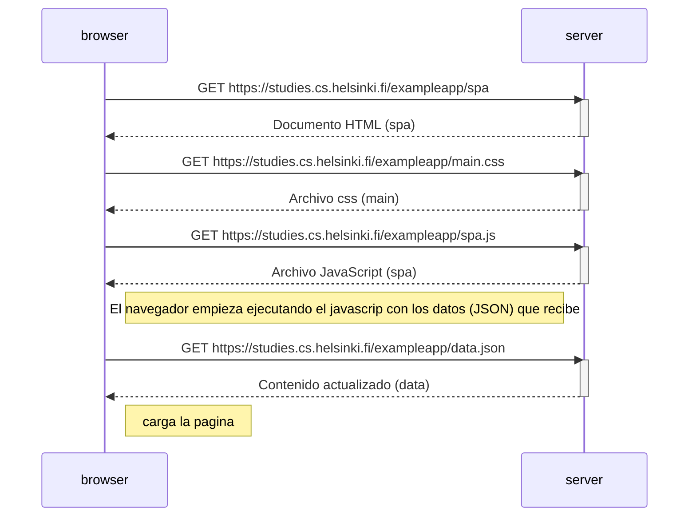
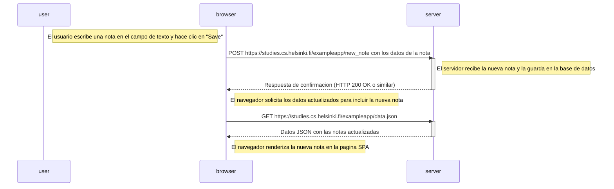

## FullstackProject2024 🚀

### 💡 **Curso Fullstack de Programación**
Bienvenidos a la entrega de ejercicios del curso Fullstack de Programación. Este repositorio contiene los proyectos y ejercicios completados.

### 📂 **Ejercicios 0.4 - 0.6**

📌 **Ejercicio 0.4** - *Diagrama de Eventos: Nueva Nota (Tradicional)*  
Diagrama que describe la situación en la que el usuario crea una nueva nota en la página   

📌 **Ejercicio 0.5** - *Diagrama de Eventos: Carga pagina con (SPA)*  
Diagrama que describe la situación en la que el usuario accede a la versión de aplicación de una sola página

📌 **Ejercicio 0.6** - *Diagrama de Eventos: Nueva Nota (SPA)*  
Diagrama que representa la situación en la que el usuario crea una nueva nota utilizando la versión de una sola página de la aplicación.  

📬 **Contacto**
- GitHub: /N3WL4ND5  
* Correo Electrónico: jeanpier.madridb@gmail.com